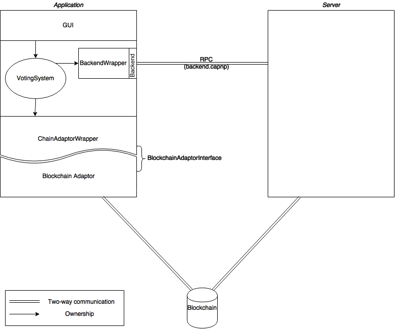

# Architecture of the Stake Weighted Voting Application

This document describes the software architecture used for the Stake-Weighed Voting application. Only the application is documented here; external components such as the server and the blockchain adaptor are documented in their respective repositories.

The interface to the server is defined [here](../shared/capnp/backend.capnp) and `BlockchainAdaptorInterface` is defined [here](../shared/BlockchainAdaptorInterface.hpp)

The GUI in the application is written in QML, and it is the logical entry point of the application. `main()`'s purpose is to set up the QML environment, any global initializations, and launch the UI. It is probably not a good place to start when trying to understand how the application functions.

All classes belonging solely to the voting application should be in the `swv` namespace.

The central controller for the application is `VotingSystem`, which is instantiated in from the GUI in [main.qml](qml/main.qml). `VotingSystem` is a controller class and generally only one will exist per application.

The `VotingSystem` creates and owns two interfaces: `BackendWrapper`, which communicates with the server; and `ChainAdaptorWrapper`, which communicates with the blockchain. These wrappers are actually just layers on top of low level classes. The wrappers provide QML-friendly interfaces to the low level implementations, and these low level classes do the heavy lifting. More information on the wrappers is available [here](wrappers/README.md).

The `BackendWrapper` wraps a `Backend::Client` object, which is the Cap'n Proto generated client for the interface defined in `backend.capnp`. The wrapper implements methods which, unless otherwise commented, expose the interface directly to QML and convert data between Cap'n Proto containers and Qt containers as necessary. The data types which are defined in Cap'n Proto that must be manipulated in QML are wrapped. All such data wrappers should be in the `wrappers/` directory, and have the same name as the type they wrap, except that they exist in the `swv` namespace.

Lifetime of these wrappers must be handled carefully, as sometimes they are created in C++ but transferred to QML (and thus the QML runtime owns and must delete them), but in other cases, the C++ retains ownership. Any time a raw pointer is returned, the function should be documented as to whether the returned object is owned by the caller or callee. The [C++/QML Data Ownership Documentation](http://doc.qt.io/qt-5/qtqml-cppintegration-data.html#data-ownership) explains the circumstances under which ownership is transferred, and **must** be understood before working with any of the wrapper classes.

> ###### Implementation Note:
> When the C++ classes return a `Promise`, the C++ retains ownership of the promise until the promise resolves or breaks. At that point, ownership transfers to QML. Unless otherwise documented, any objects the promise resolves to are owned by QML immediately.

The `ChainAdaptorWrapper` wraps some implementor of `BlockchainAdaptorInterface` and exposes blockchain functionality to callers. The `ChainAdaptorWrapper` is also responsible for managing decisions, including persisting pending decisions.

## GUI Architecture
The GUI is written with the [QML Material](https://github.com/papyros/qml-material) library, which provides various Material Design components and generally simplifies the process of making an application look good on many different devices. In this document, types defined by the Material library are referenced as `Material.Type` to avoid confusion.

The UI code is broken up by pages which are displayed as a stack managed by `Material.ApplicationWindow`. The `VotingSystem` is created in `main.qml` as a child of the `Material.ApplicationWindow`, and since all UI components are children of the `Material.ApplicationWindow`, they can all reference the `VotingSystem` directly using QML [dynamic scoping](http://doc.qt.io/qt-5/qtqml-documents-scope.html#component-instance-hierarchy). To avoid spaghetti code, dynamic scoping should only ever be used to reference application-wide objects defined in `main.qml`. All other dynamic scope resolution should be considered a bug and replaced with a property interface, as described in the page linked above.

All UI page components are expected to be instances of `Material.Page` and to be defined in files named `*Page.qml`. Any time a component within some QML file grows to be more than a screen of code, that component is a candidate for extraction into its own file. It is not required that the component be reusable elsewhere. Of course, if a component is reusable elsewhere, it should also be extracted into its own file. When doing such extractions, be careful to define interfaces explicitly so as not to accidentally invoke dynamic scoping.